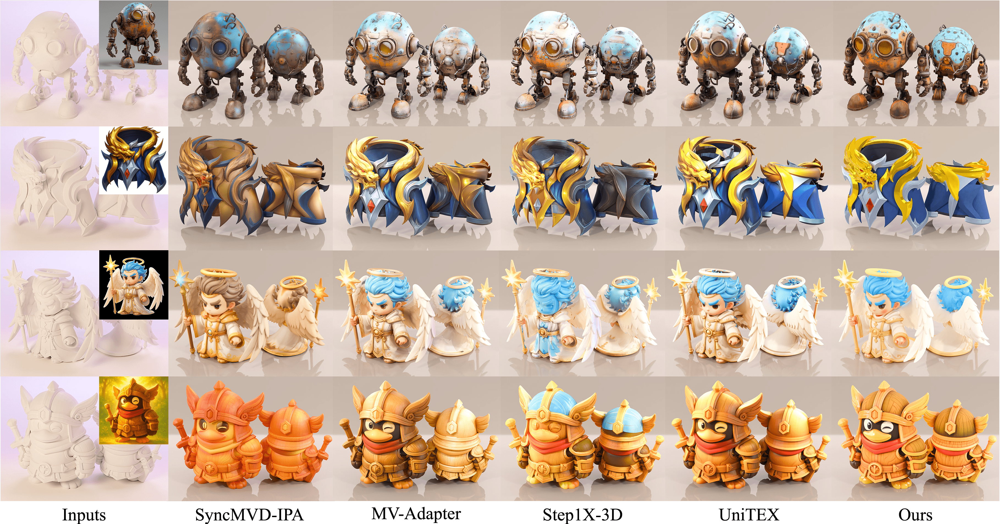
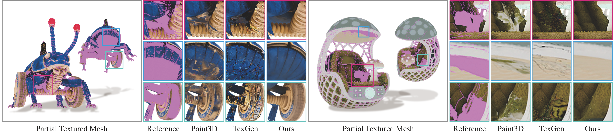
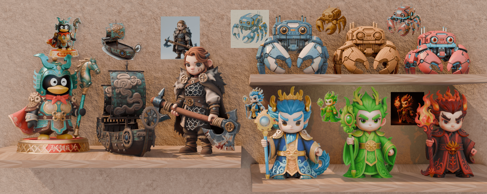
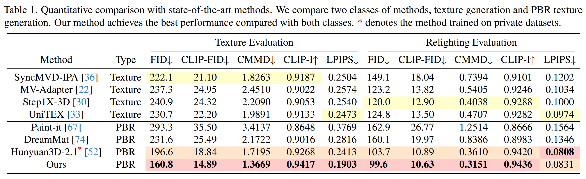

<h1 align="center"><a href="#">LumiTex: Towards High-Fidelity PBR Texture Generation with Illlumination Context
</a></h2>

 

## Video

## Results

## Paper & Code
Under internal review for public release...
