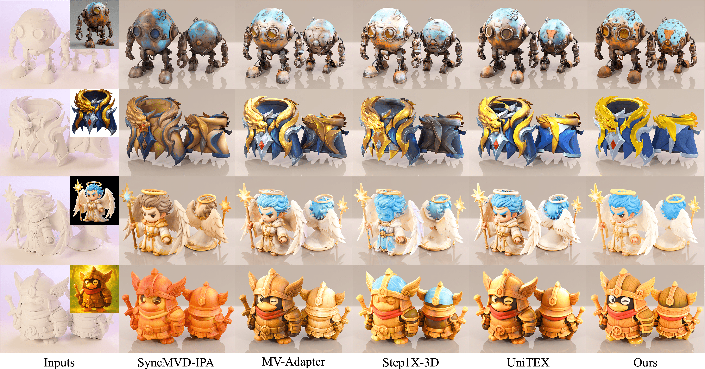
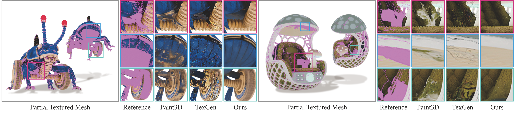
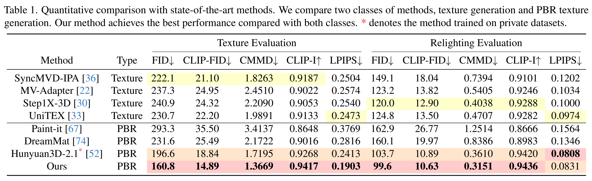

<h1 align="center"><a href="#">LumiTex: Towards High-Fidelity PBR Texture Generation with Illlumination Context
</a></h2>

[](https://lumitex.vercel.app)
[](https://arxiv.org/abs/2511.19437)
[](https://www.apache.org/licenses/LICENSE-2.0) 

## Video
[](https://youtu.be/3qPrfFqFEbk)

## Installation & Usage

### Environment Setup

Option 1. (Tested on CUDA 12.8) Setup with `conda`.
```bash
conda install -c conda-forge cuda-toolkit=12.8
conda create -n lumitex python=3.11
conda activate lumitex

pip install torch==2.7.0 torchvision==0.22.0 torchaudio==2.7.0 --index-url https://download.pytorch.org/whl/cu128
pip install -r requirements.txt

# install Hunyuan3D-2.1 renderer
cd Renderer/custom_rasterizer
pip install --no-build-isolation -e .
cd ../DifferentiableRenderer
bash compile_mesh_painter.sh
cd ../..
```

Option 2. (Tested on CUDA 12.8) Setup with `pixi`. Make sure you have pixi installed.
```bash
pixi shell
pixi run post-install
```

### Model Weights

Please download the pre-trained model weights from Huggingface ([FLUX-MV-Shaded](https://huggingface.co/Jingzhi03/FLUX-MV-Shaded)), and the lightweight LoRA weights (trained on data [Step1X-3D](https://huggingface.co/datasets/stepfun-ai/Step1X-3D-obj-data/tree/main)).

Assume the model is put on the `ckpt` folder in inference.py by default.

### Inference

**Data:** Structure your data (reference image and mesh) as in the `tests` folder: ref.png, *.obj/glb.

Then run the command as below, the pipeline generates and inpaints basecolor by default (more details see inference.py).
```bash
python inference.py --folder tests/case_1
```

### Acceleration

Pipeline acceleration techniques like `torch.compile`, [`cache-dit`](https://github.com/vipshop/cache-dit), [`flash-attn3`](https://huggingface.co/kernels-community/flash-attn3) are compatible with our pipeline.

## Results









## TODO
- [x] Evaluation code.
- [x] Inference pipeline and pretrained model.
- [x] Data processing and infra code.
  - Rendering script: see details in `data_pipeline/blender_scripts`.
  - Data infra: [data_pipeline/README.md](./data_pipeline/README.md).


## Acknowledgement
We would like to express our gratitude to the authors of the following projects for their efforts and open contributions: [Diffusers](https://github.com/huggingface/diffusers), [FLUX.1-dev](https://github.com/black-forest-labs/flux), [Huggingface](https://huggingface.co/), [UniTEX](https://github.com/YixunLiang/UniTEX), [LVSM](https://github.com/haian-jin/LVSM), [LaCT](https://github.com/a1600012888/LaCT/tree/main), [Hunyuan3D-2.1](https://github.com/Tencent-Hunyuan/Hunyuan3D-2.1), [Hunyuan3D-2.5](https://3d.hunyuan.tencent.com/).


## License
This repository is licensed under the Apache License 2.0. This project also uses third-party components with non-commercial license: FLUX model, Tencent Hunyuan3D-2.1 rendering code. These components are subject to their respective licenses and may restrict commercial use. Users are responsible for complying with all applicable licenses.


## BibTeX

```
@inproceedings{
  lumitex2026,
  title={LumiTex: Towards High-Fidelity {PBR} Texture Generation with Illumination Context},
  author={Jingzhi Bao and Hongze Chen and Lingting Zhu and Chenyu Liu and Runze Zhang and keyang luo and Zeyu HU and Weikai Chen and Yingda Yin and Xin Wang and Zehong Lin and Jun Zhang and Xiaoguang Han},
  booktitle={The Fourteenth International Conference on Learning Representations},
  year={2026},
  url={https://openreview.net/forum?id=CDwG0Bebfo}
}
```
