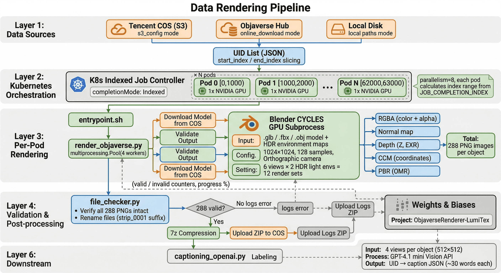

# LumiTex Data Pipeline

Multi-view rendering pipeline for generating PBR training data from Objaverse 3D assets.

> **Note:** Confidential information (API keys, bucket names, internal endpoints) are masked in config files.

## Overview

This pipeline renders 3D models into multi-view images with PBR material decomposition, environment lighting, and depth/normal passes. The core workflow:

1. Load a list of 3D model UIDs
2. Download models from S3/COS or Objaverse Hub
3. Render each model via Blender CYCLES (GPU) with HDR environment maps
4. Validate output integrity (288 images per object)
5. Zip and upload results to S3/COS



## Directory Structure

```
data_pipeline/
├── render_objaverse.py        # Main orchestrator (multiprocessing + Blender subprocess)
├── config.yaml                # Rendering parameters (resolution, views, materials, etc.)
├── requirements.txt           # Python dependencies
├── file_checker.py            # Output validation + 7z compression
├── parse_exr_depth.py         # EXR depth map -> single-channel EXR conversion
├── captioning_openai.py       # Multi-view image captioning via OpenAI Vision API
├── s3_downloader.py           # Batch download + parallel unzip from S3/COS
├── blender_scripts/           # Blender rendering engine
│   ├── blender_script.py      # Main Blender render script (CYCLES, multi-view, PBR)
│   ├── blender_utils_helper.py  # Material/shader manipulation (PBR decomposition)
│   └── smart_uv.py            # UV unwrapping utilities
├── s3/                        # S3/COS integration
│   ├── s3_utils.py            # S3 client, upload/download/cleanup operations
│   ├── s3_config.yaml         # S3 connection config (credentials masked)
│   └── logger.py              # S3 module logger
└── k8s/                       # Kubernetes containerized deployment
    ├── Dockerfile             # CUDA 12.4 + Blender 4.2 + Python 3.11
    ├── entrypoint.sh          # Pod entrypoint (index-based work splitting)
    ├── job.yaml               # K8s Indexed Job manifest
    ├── configmap.yaml         # Task configuration
    ├── secret.yaml            # Credentials template
    ├── pvc.yaml               # Shared storage (ReadWriteMany)
    ├── build.sh               # Docker image build script
    └── README.md              # K8s deployment guide
```

## Rendering Pipeline

### render_objaverse.py

The main entry point. Distributes rendering across CPU workers, each spawning a Blender subprocess with GPU acceleration.

```bash
python render_objaverse.py \
    --download_dir data/objaverse \
    --envmap_dir envmaps \
    --data_uids data/LumiTex_pbr_uids.json \
    --output_dir test_render \
    --start_index 0 --end_index 1000 \
    --processes 8 --gpu_id 0 \
    --s3_config s3/s3_config.yaml \
    --render_material \
    --log_to_wandb
```

**Key arguments:**

| Argument | Description |
|----------|-------------|
| `--start_index / --end_index` | UID slice range (for distributed rendering) |
| `--processes` | Number of parallel Blender workers |
| `--gpu_id` | CUDA device index |
| `--s3_config` | S3/COS config for model download and result upload |
| `--render_material` | Enable PBR material pass (metallic/roughness) |
| `--online_download` | Download models directly from Objaverse Hub |
| `--log_to_wandb` | Enable Weights & Biases progress tracking |

**Data source modes (mutually exclusive):**

- `--s3_config`: Download models from Tencent COS (S3-compatible)
- `--online_download`: Download from Objaverse Hub via `objaverse` library
- Neither: Use local paths from `data/train_local_paths.json`

### Blender Rendering

Each model is rendered by calling Blender in batch mode:

```
blender -b -P blender_script.py -- --object_path <model> --envmap_dir <hdrs> ...
```

**Render configuration** (from `config.yaml` / hardcoded defaults):

- Engine: CYCLES (GPU, CUDA/OptiX)
- Resolution: 1024x1024, 128 samples, denoising enabled
- Camera: Orthographic, unit sphere projection
- Views: 6 camera angles x 2 HDR light environments = 12 render sets
- Output passes: RGBA, Normal, Depth (Z), Camera Center Map (CCM)
- Material mode: PBR (R=1.0, G=roughness, B=metallic)
- Total output: **288 PNG images per object**

### Post-processing

- **file_checker.py**: Validates all 288 PNGs per object are intact, renames Blender output files (strips `_0001` suffix), compresses output via `7z`
- **parse_exr_depth.py**: Converts multi-channel EXR depth maps to single-channel Z format

## S3/COS Integration

The pipeline integrates with Tencent Cloud Object Storage (S3-compatible) for both input (model download) and output (rendered result upload).

- **Download**: Models fetched on-demand per UID from `cos_paths.download_dir`
- **Upload**: After rendering completes, results are zipped and uploaded to `cos_paths.upload_dir/{taskid}/`
- **Cleanup**: Local files are removed after successful upload
- **Auth**: boto3 credentials via environment variables (`AWS_ACCESS_KEY_ID`, `AWS_SECRET_ACCESS_KEY`)

## Captioning (captioning_openai.py)

Generates text descriptions for rendered objects using OpenAI Vision API (GPT-4.1 mini). Selects 4 representative views per object, resizes to 512x512, and requests a concise caption (~30 words). Output is a JSON mapping of UID to caption text.

## Kubernetes Deployment

See [`k8s/README.md`](k8s/README.md) for containerized distributed rendering using K8s Indexed Jobs. Splits the UID list across multiple GPU pods automatically.

## Dependencies

- **Blender 4.2+** (CYCLES GPU rendering)
- **CUDA toolkit** (GPU acceleration)
- **7z** (output compression)
- Python: `numpy`, `objaverse`, `boto3`, `OpenEXR`, `Pillow`, `tqdm`, `wandb`, `pyyaml`
